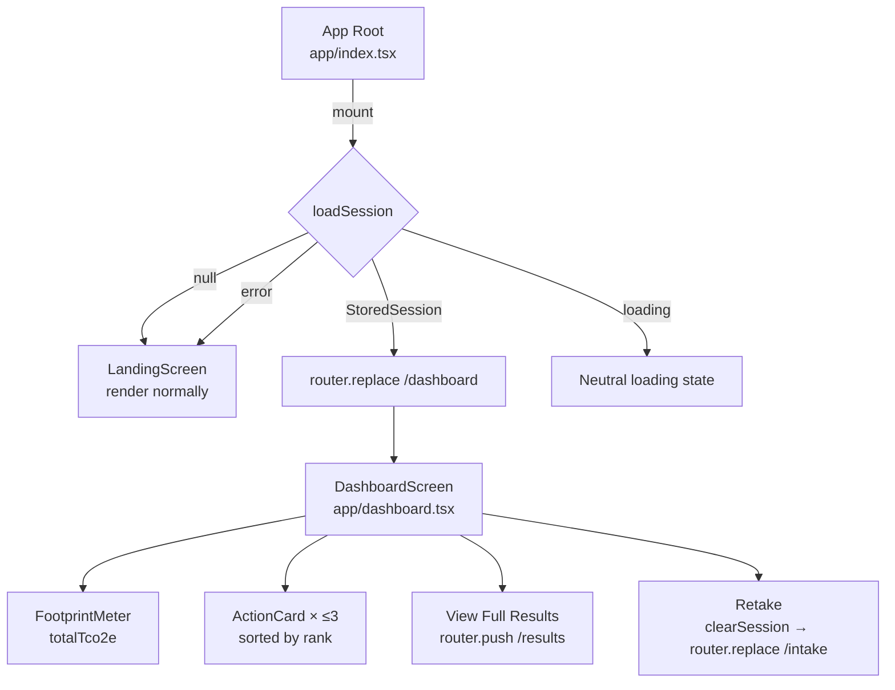

# Design Document: Returning User Dashboard

## Overview

The Returning User Dashboard is a persistent home screen for users who have already completed the CarbonSense questionnaire. When the app root mounts and finds a valid `StoredSession` in `AsyncStorage`, it silently redirects to `/dashboard` instead of rendering the onboarding `LandingScreen`. The dashboard surfaces the user's footprint score, their top 3 recommended actions, and two navigation controls — one to the full results screen and one to retake the questionnaire.

The feature touches two existing files (`app/index.tsx` and `src/lib/storage.ts`) and adds one new route file (`app/dashboard.tsx`). No new data-fetching or backend calls are required; the dashboard is entirely driven by the already-persisted `StoredSession`.

---

## Architecture



The routing model is **replace-based**: the app root replaces itself with `/dashboard` so the user cannot back-navigate to the landing screen. Similarly, retaking replaces `/dashboard` with `/intake`.

---

## Components and Interfaces

### Modified: `app/index.tsx`

Adds a `useEffect` that calls `loadSession()` on mount. While the check is in-flight, a minimal loading indicator is shown (a single `ActivityIndicator` centred on the background colour). On resolution:

- Session found → `router.replace('/dashboard')`
- Session null / error → render the existing `LandingScreen` JSX as normal

The loading state must be shown **before** the full landing content renders to avoid a flash of onboarding UI.

```ts
// Pseudocode for the new mount effect
const [checking, setChecking] = useState(true);

useEffect(() => {
  loadSession()
    .then(session => {
      if (session) router.replace('/dashboard');
    })
    .catch(() => { /* fall through to landing */ })
    .finally(() => setChecking(false));
}, []);

if (checking) return <LoadingPlaceholder />;
return <LandingScreenContent />;
```

### New: `app/dashboard.tsx`

Default export `DashboardScreen`. Reads the session from storage on mount (same `loadSession` call), then renders:

| Section | Component | Data source |
|---|---|---|
| Wordmark header | Inline (logo mark + "CarbonSense") | Static |
| Footprint score | `FootprintMeter` | `session.footprint_result.total_tco2e` |
| Calculated date | `Text` | `session.created_at` formatted |
| Top actions | `ActionCard` × ≤3 | `session.actions` sorted by `rank` |
| View Full Results | `Pressable` | navigates to `/results` |
| Retake | `Pressable` | clears session → navigates to `/intake` |

If `total_tco2e <= 0`, the `FootprintMeter` is replaced by a fallback `Text` message.  
If `actions` is empty, the actions section is replaced by a prompt to view full results.

### Reused: `FootprintMeter` and `ActionCard`

Both components are consumed without modification. `FootprintMeter` accepts `{ totalTco2e: number }`. `ActionCard` accepts `{ action: Action }`.

---

## Data Models

No new data models are introduced. The dashboard is driven entirely by the existing `StoredSession` type:

```ts
interface StoredSession {
  schema_version: string;   // validated by loadSession
  session_id: string;
  habit_profile: HabitProfile;
  footprint_result: FootprintResult;  // .total_tco2e used for meter
  actions: Action[];                  // sorted by .rank, capped at 3
  created_at: string;                 // ISO 8601 → formatted display string
}
```

### Date formatting

`created_at` is an ISO 8601 string (e.g. `"2025-01-05T14:30:00Z"`). It is formatted for display using the built-in `Intl.DateTimeFormat` API (available in Hermes / React Native):

```ts
function formatCreatedAt(iso: string): string {
  const date = new Date(iso);
  return date.toLocaleDateString('en-US', { month: 'short', day: 'numeric', year: 'numeric' });
  // → "Jan 5, 2025"
}
```

No third-party date library is needed.

### Top actions derivation

```ts
const topActions = [...session.actions]
  .sort((a, b) => a.rank - b.rank)
  .slice(0, 3);
```

---

## Correctness Properties

*A property is a characteristic or behavior that should hold true across all valid executions of a system — essentially, a formal statement about what the system should do. Properties serve as the bridge between human-readable specifications and machine-verifiable correctness guarantees.*

### Property 1: Session presence determines route

*For any* app root mount, if `loadSession` returns a non-null `StoredSession`, the router action issued SHALL be `replace('/dashboard')`; if it returns `null` or throws, no redirect SHALL occur.

**Validates: Requirements 1.1, 1.2, 1.4**

---

### Property 2: Loading state precedes landing content

*For any* app root render, the full `LandingScreen` content SHALL NOT be visible while the session check is still in-flight (i.e., before `loadSession` resolves or rejects).

**Validates: Requirements 1.3**

---

### Property 3: Top actions are rank-sorted and capped at 3

*For any* `StoredSession` with an arbitrary `actions` array, the dashboard SHALL display at most 3 `ActionCard` elements, and their `rank` values SHALL be non-decreasing from top to bottom.

**Validates: Requirements 3.1**

---

### Property 4: Zero/negative score shows fallback

*For any* `StoredSession` where `total_tco2e <= 0`, the `FootprintMeter` component SHALL NOT be rendered; a fallback message SHALL be rendered in its place.

**Validates: Requirements 2.4**

---

### Property 5: Empty actions shows prompt

*For any* `StoredSession` where `actions` is an empty array, no `ActionCard` SHALL be rendered; a prompt to view full results SHALL be rendered instead.

**Validates: Requirements 3.4**

---

### Property 6: Retake clears session before navigating

*For any* dashboard state, activating the Retake control SHALL call `clearSession` before issuing any router action; even if `clearSession` throws, the router SHALL still navigate to `/intake`.

**Validates: Requirements 5.2, 5.3, 5.4**

---

### Property 7: Date formatting round-trip

*For any* valid ISO 8601 date string stored in `created_at`, `formatCreatedAt` SHALL return a non-empty string that contains the 4-digit year present in the input.

**Validates: Requirements 2.3**

---

## Error Handling

| Scenario | Behaviour |
|---|---|
| `loadSession` throws on app root mount | Catch swallows error; `LandingScreen` renders normally (Req 1.4) |
| `loadSession` returns null on dashboard mount | Dashboard redirects to `/intake` (session was cleared externally) |
| `total_tco2e <= 0` | Fallback message replaces `FootprintMeter` (Req 2.4) |
| `actions` is empty | Prompt replaces action list (Req 3.4) |
| `clearSession` throws on retake | Error is caught; navigation to `/intake` proceeds regardless (Req 5.4) |
| Invalid `created_at` string | `new Date(iso)` returns `Invalid Date`; `toLocaleDateString` returns `"Invalid Date"` — acceptable fallback, no crash |

---

## Testing Strategy

### Unit tests

Focus on pure functions and specific examples:

- `formatCreatedAt` with a known ISO string → expected formatted output
- `formatCreatedAt` with an invalid string → does not throw
- Top-actions derivation: given an unsorted array of 5 actions, result is sorted and length is 3
- Top-actions derivation: given an array of 2 actions, result length is 2 (no padding)
- `DashboardScreen` with `total_tco2e = 0` renders fallback text, not `FootprintMeter`
- `DashboardScreen` with empty `actions` renders the "view full results" prompt
- `app/index.tsx` with null session renders `LandingScreen` content
- `app/index.tsx` with a valid session calls `router.replace('/dashboard')`

### Property-based tests

Use **fast-check** (already compatible with Jest in this project) with a minimum of **100 runs per property**.

Each test is tagged with a comment in the format:
`// Feature: returning-user-dashboard, Property N: <property text>`

| Property | Generator inputs | Assertion |
|---|---|---|
| P1: Session presence determines route | Arbitrary `StoredSession \| null` | `null` → no replace call; non-null → `replace('/dashboard')` called |
| P3: Top actions rank-sorted and capped | Arbitrary `Action[]` of length 0–20 | Result length ≤ 3; ranks non-decreasing |
| P4: Zero/negative score shows fallback | `fc.float({ max: 0 })` for `total_tco2e` | `FootprintMeter` absent; fallback text present |
| P5: Empty actions shows prompt | `StoredSession` with `actions: []` | No `ActionCard`; prompt text present |
| P6: Retake clears before navigating | Any dashboard state; `clearSession` may throw | `clearSession` called before router; router always called |
| P7: Date formatting round-trip | Arbitrary valid ISO date strings | Result is non-empty string containing the 4-digit year |

Property tests live in `__tests__/dashboard.property.test.ts`.
Unit tests live in `__tests__/dashboard.test.ts`.
